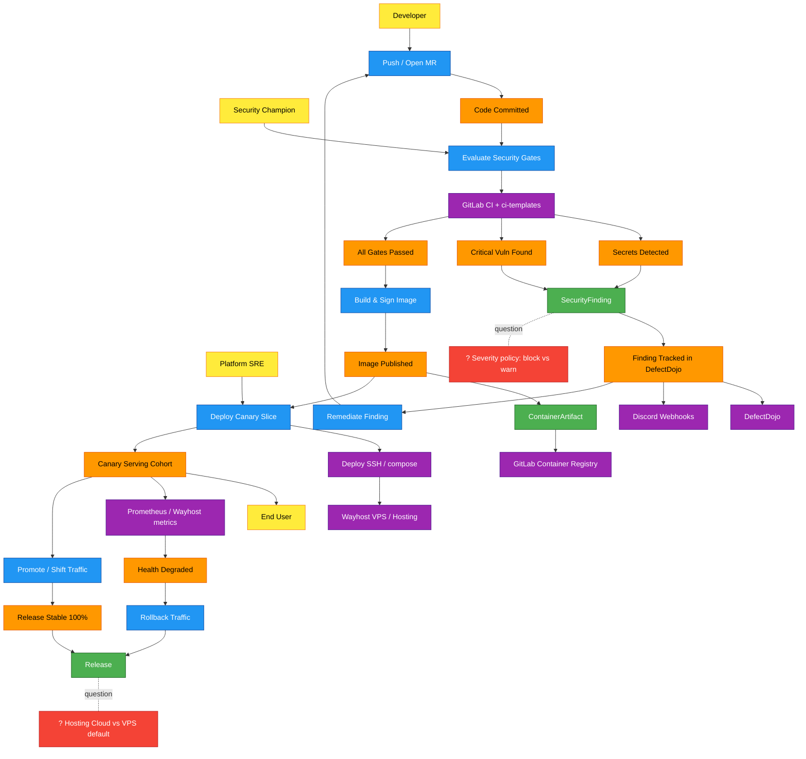
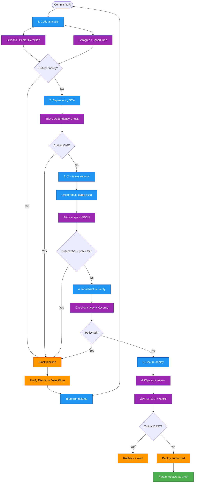
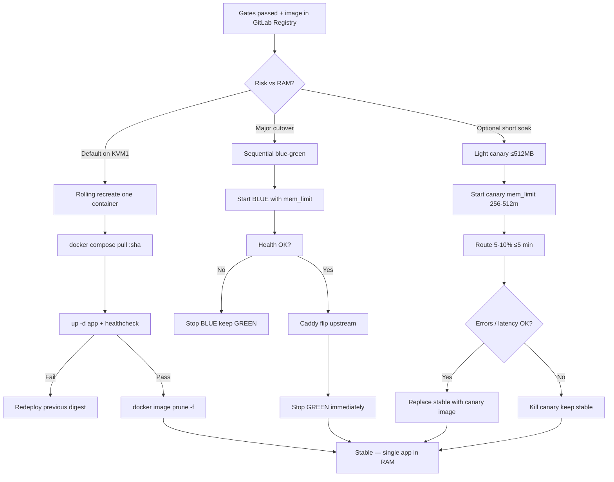
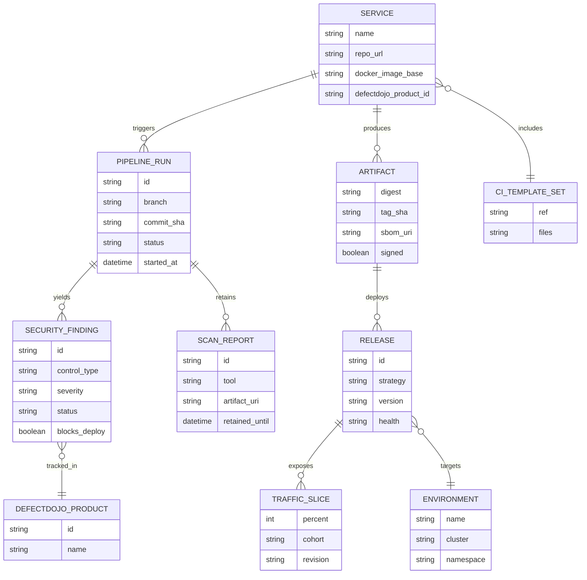
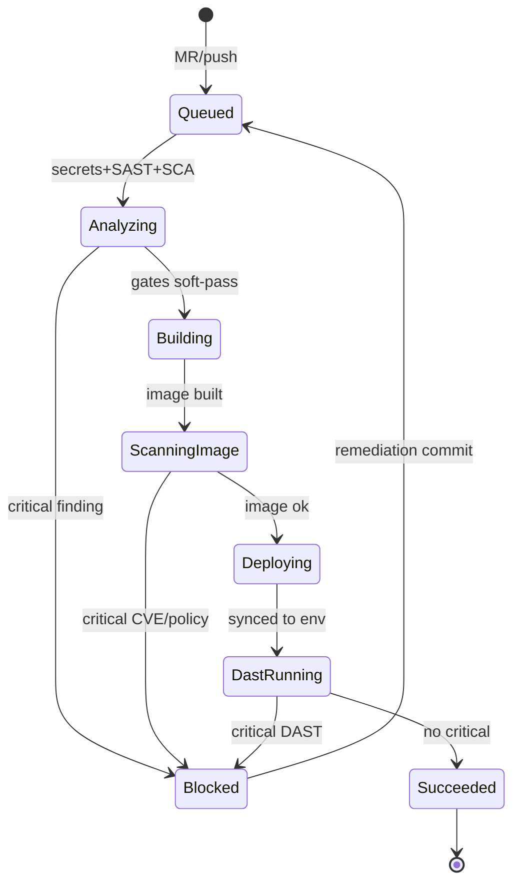
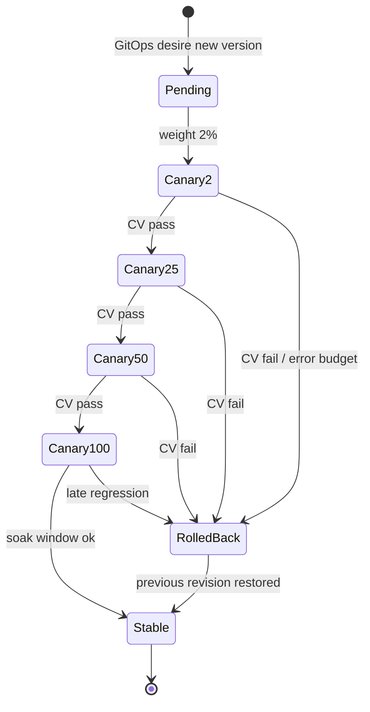
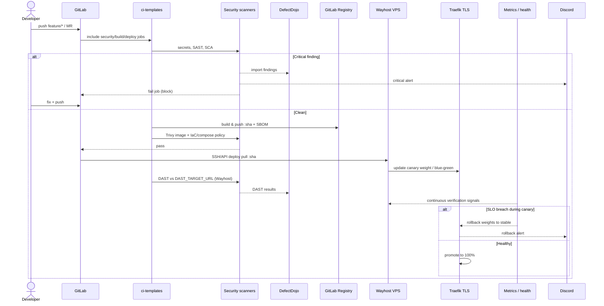

# DevSecOps Design Catalog — ITNET / EPITNET

Navigable architecture for a **secure, centralized CI/CD platform** on **GitLab + Wayhost**, applying ITNET DevSecOps workshop controls, Harness progressive delivery patterns, and secure-pipeline practices.

**Cloud constraint:** Wayhost only ([wayhost.cloud](https://wayhost.cloud)) — no AWS / Azure / GCP.

| Artifact | Path |
|----------|------|
| Requirements | [requirements.md](./requirements.md) |
| Platform architecture | [platform-architecture.md](./platform-architecture.md) |
| ADRs | [adrs/ADR-001-to-004.md](./adrs/ADR-001-to-004.md) |
| Platform API | [api-platform.md](./api-platform.md) |
| KVM1 capacity | [capacity-kvm1.md](./capacity-kvm1.md) |
| **VPS setup guide** | [../../infra/kvm1/README.md](../../infra/kvm1/README.md) |

**Verdict:** Industrialize with shared `ci-templates`, five security gates that **block on critical**, immutable images in **GitLab Registry**, deploy to **Wayhost KVM1 via Docker Compose** (not k3s), and **rolling-first** releases with sequential blue-green when needed.

**Pinned VPS:** KVM1 — 1 vCPU / 4 GB / 50 GB Ubuntu. Capacity plan: [capacity-kvm1.md](./capacity-kvm1.md).

---

## Big picture (EventStorming)

---

## Process: Secure pipeline gates

---

## Process: Progressive delivery

---

## Process: AI site generator (hackathon)

```mermaid
flowchart LR
    classDef event fill:#ff9800,stroke:#e65100,color:#000
    classDef command fill:#2196f3,stroke:#0d47a1,color:#fff
    classDef actor fill:#ffeb3b,stroke:#f57f17,color:#000
    classDef hotspot fill:#f44336,stroke:#b71c1c,color:#fff

    User[User describes site]:::actor --> Gen[AI generates site code]:::command
    Gen --> Distrust[Never trust by default]:::event
    Distrust --> Commit[Commit to repo / MR]:::command
    Commit --> Pipe[DevSecOps pipeline]:::command
    Pipe --> Build[Build hardened image]:::command
    Build --> Deploy[Deploy if gates green]:::command
    Deploy --> Headers[Enforce HTTPS / HSTS headers]:::command
    Headers --> Live[Site available + monitored]:::event
    Live -.question.- Hot["? Wayhost Hosting Cloud vs VPS+Docker"]:::hotspot
```

---

## Data model

---

## State: Pipeline run

---

## State: Release (canary)

---

## Sequence: Secure release

---

## Architect review summary

| Area | Assessment |
|------|------------|
| Pattern fit | Industrialized templates + shift-left gates match ITNET docs |
| Cloud fit | Wayhost VPS + Hosting Cloud only — no hyperscalers |
| Security | Secrets→SAST→SCA→image→compose policy→DAST + TLS/HSTS on Wayhost |
| Delivery risk | Rolling-first on KVM1; sequential BG; light canary only |
| Debt risk | Auto-DevOps in `backend-jarvis` → migrate to `ci-templates` |
| Evolution | k3s only after KVM2+/8GB; Cosign; platform API |

## Confirm before implementation

1. SSH deploy key + UFW allowlist for GitLab runners  
2. Hosting Cloud vs VPS for static AI sites  
3. Critical CVE severities that hard-block  
4. DefectDojo remote (not on KVM1)  

## Next steps

1. Scaffold `ci-templates` + replace Auto-DevOps in pilot repo  
2. Ansible baseline on KVM1: Docker, Caddy, UFW, swap=1G, prune cron  
3. Compose with `mem_limit` / healthcheck; deploy = pull `:sha` + rolling  
4. Discord alerts; keep scanners on GitLab runners only
