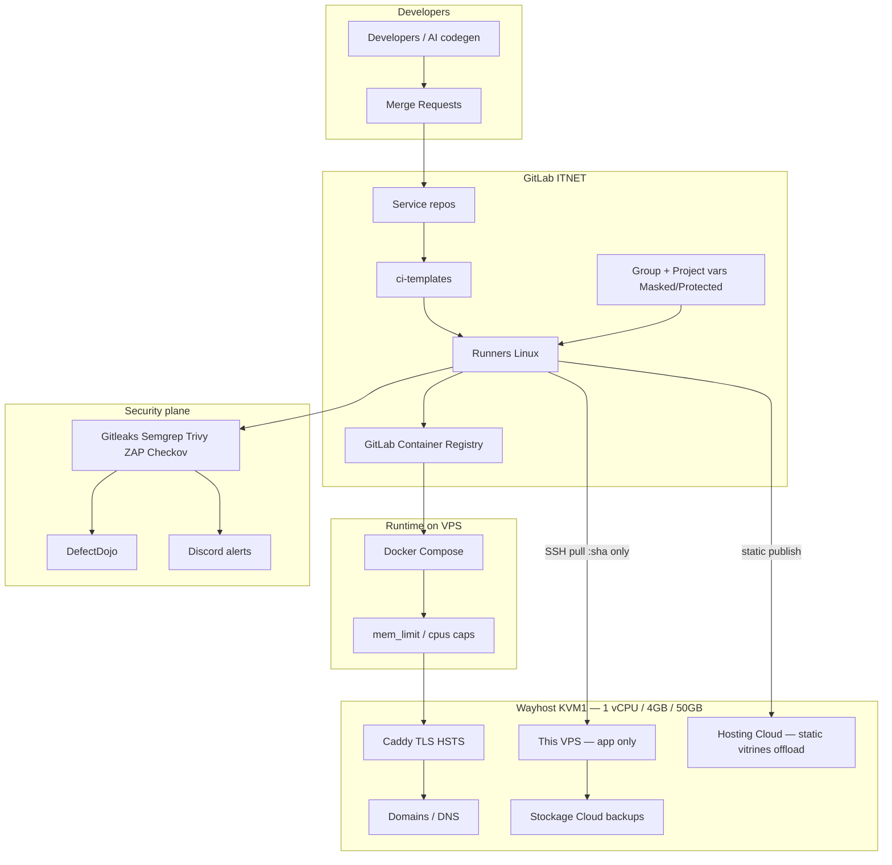

# Platform architecture — Wayhost DevSecOps for ITNET

**Cloud constraint:** Wayhost only ([wayhost.cloud](https://wayhost.cloud)) — no AWS, no Azure, no GCP.

Wayhost is ITNET’s sovereign cloud (immersion-cooled DC, FR/FI positioning): **VPS Cloud**, **Hosting Cloud**, IaaS, object storage, domains, dedicated/colocation. Hackathon projects deploy here.

## 1. Logical view



## 2. Wayhost resource map (target)

| Need | Wayhost product | Role in platform |
|------|-----------------|------------------|
| Showcase / static sites | **Hosting Cloud** | **Preferred** — keeps KVM1 RAM free |
| API / generator runtime | **This KVM1 VPS** | Docker Compose + Caddy only |
| Heavy scanners / DefectDojo | **GitLab runners / remote** | **Never** on the 4 GB box |
| Assets / backups | **Stockage Cloud** | Off-box retention |
| Public names | **Nom de domaine** | Point to VPS or Hosting |

**Pinned hardware:** KVM1 — Ubuntu, 1 vCPU, 4 GB, 50 GB. See [capacity-kvm1.md](./capacity-kvm1.md).

**Not in scope on this VPS:** k3s, GitLab Runner, full Prometheus stack, DefectDojo, dual always-on replicas.

## 3. Topology (single KVM1)

| Environment | How |
|-------------|-----|
| Build/test/scan | GitLab runners only |
| Runtime | One KVM1: `edge` + `app` (compose) |
| Static demos | Hosting Cloud when possible |

Minimum path: CI scans → push image → SSH `docker compose pull && up -d` → healthcheck → prune.

## 4. IaC (Ansible-first)

```text
infra/
  ansible/
    site.yml              # docker, ufw, caddy, swapfile, logrotate, prune cron
    inventory/wayhost.ini # this KVM1
  compose/
    docker-compose.yml    # mem_limit / cpus / healthcheck / logging caps
    Caddyfile
```

Terragrunt/Terraform only if Wayhost API provisions VPS; day-2 config is Ansible.

## 5. Docker vs k3s (locked)

| | Docker Compose | k3s |
|--|----------------|-----|
| Overhead on KVM1 | ~200–350 MB | ~1.5 GB class + needs 2 CPU baseline |
| Verdict | **Use** | **Do not use** until KVM2+ / 8 GB |

## 6. Progressive delivery (RAM-safe)

| Strategy | Rule on KVM1 |
|----------|----------------|
| Rolling (default) | Recreate one container; rollback = previous digest |
| Blue-green | Sequential: start → flip → **stop old now** |
| Canary | Optional tiny replica ≤5 min; not multi-hour dual run |

Edge: **Caddy** (or nginx). Weighted canary only if both containers fit memory budget.

## 7. Security & GitLab

Same five gates; deploy only after pass. Registry = GitLab Container Registry (optional while ITNET registry is off — VPS local build).  
**DefectDojo is remote only** — never on KVM1. CI job `defectdojo_import` pushes scan artifacts via API when `DEFECTDOJO_URL` + `DEFECTDOJO_API_TOKEN` are set. See [defectdojo-integration.md](../guides/defectdojo-integration.md).  
Group vars: Discord (+ DefectDojo); project: `SERVICE_NAME`, `WAYHOST_HOST`, `DAST_TARGET_URL`, `PROD_APP_URL`.

## 8. AI site generator path

1. AI generates site → never trust by default  
2. Commit → DevSecOps pipeline (runners)  
3. **Hosting Cloud** for static/simple; **this VPS** only if custom container runtime  
4. HTTPS + HSTS before public demo  
5. Watch Wayhost panel CPU/RAM (no heavy on-box APM)

## 9. Observability & incidents (lean)

- Wayhost panel + optional `node_exporter` only  
- Rollback = previous image digest via compose  
- Chaos on staging only if you have spare capacity — do not fill disk on sole prod KVM1 during demo  

## 10. Hotspots

- ? Hosting Cloud CI publish (SFTP/API)  
- ? SSH allowlist for GitLab runners  
- ? Upgrade to KVM2 before k3s / dual replicas  

Full budget: [capacity-kvm1.md](./capacity-kvm1.md).
